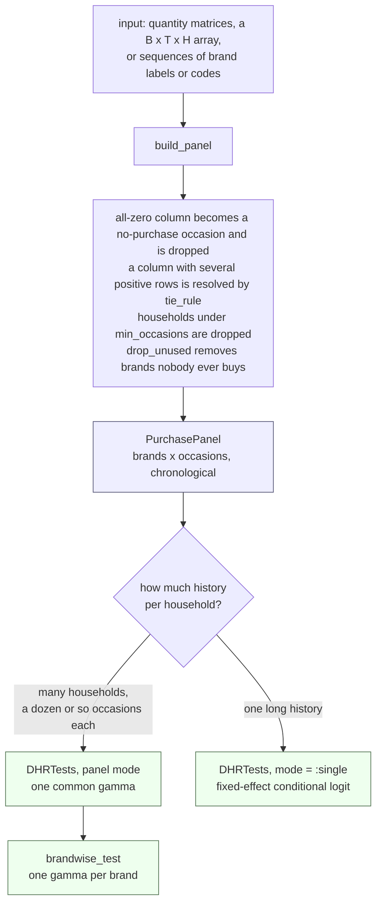
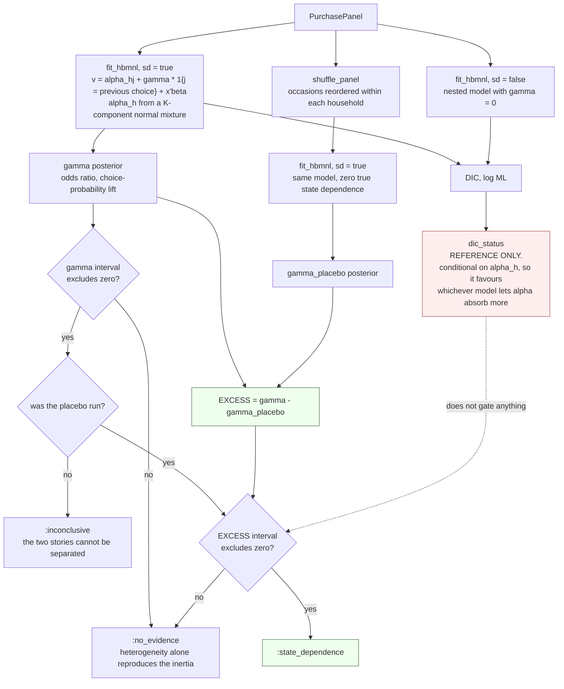
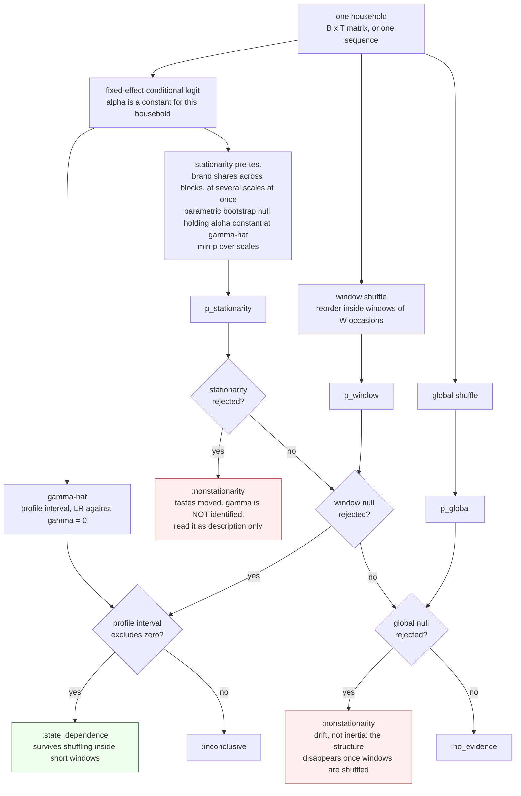
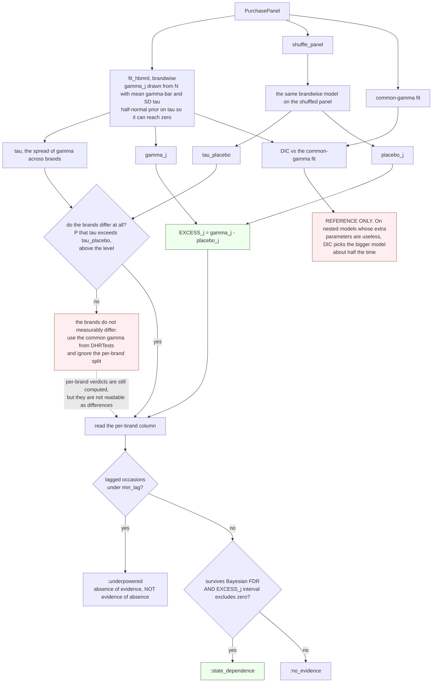
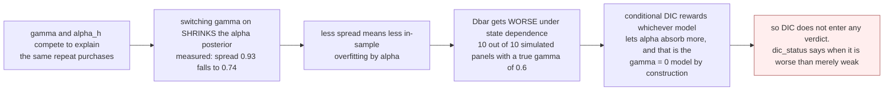

# The testing procedure / 検定の手続き

What the package actually does, from input to verdict. Diagrams render on GitHub.

入力から判定までの流れです。図は GitHub 上でそのまま描画されます。

---

## 1. Entry points / 入口

Everything starts with `build_panel`, which turns whatever you hand it into a
`PurchasePanel`: brands in rows, purchase occasions in chronological order. The
column order **is** the hypothesis, so getting it wrong invalidates everything
downstream. Which estimator to use is decided by how much history each household
has, not by preference.

まず `build_panel` がすべての入力を `PurchasePanel` に正規化します。列は時系列順で、
**その順序こそが仮説そのもの**なので、並べ違えると以降がすべて無効になります。
どの推定器を使うかは好みではなく、世帯あたりの履歴の長さで決まります。

---

## 2. Panel mode: `DHRTests(X)`

Three fits of the same hierarchical Bayes multinomial logit. The one that
carries the verdict is the **placebo**: the identical model re-fitted to a panel
whose occasions have been reordered inside each household. That panel has the
same cross-sectional composition and zero true state dependence, so whatever
`gamma` it returns is pure estimator bias. Subtracting it gives `EXCESS`.

同じ階層ベイズ多項ロジットを 3 回当てます。判定を担うのは**プラセボ**です ──
世帯ごとに購買機会の順序をシャッフルしたパネルに、まったく同じモデルを当て直します。
そのパネルは横断面の構成が同一で、真の状態依存はゼロ。したがって出てくる `gamma` は
推定量のバイアスそのものです。差し引いたものが `EXCESS` です。

Read `EXCESS`, never the raw `gamma`. A placebo that is itself large means the
heterogeneity distribution is too coarse — raise `K`. A placebo whose interval
covers zero is positive evidence that `K` was enough.

読むのは `EXCESS` であって、生の `gamma` ではありません。プラセボ自体が大きければ
異質性の分布が粗すぎるということなので `K` を上げます。プラセボの区間が 0 を跨いで
いれば、`K` が足りていたという積極的な証拠になります。

---

## 3. Single history: `DHRTests(y; mode = :single)`

With one household there is no cross-sectional heterogeneity left to confound
`gamma`. What replaces it is the household's own drift over time, which a global
shuffle cannot separate from inertia. Hence the **window** shuffle, which
reorders only inside short stretches and so leaves slow taste change in the null
hypothesis. The window null assumes tastes are constant inside a window, and the
stationarity pre-test checks that assumption **first** — a moving `alpha` is
exactly the case the window null cannot handle.

1 世帯だけなら、`gamma` を汚す横断面の異質性はありません。代わりに入ってくるのが
その世帯自身の時間的な嗜好変化で、これは全体シャッフルでは慣性と分離できません。
そこで**窓内シャッフル**を使います。短い区間の中だけで並べ替えるので、ゆっくりした
嗜好変化は帰無仮説の側に残ります。窓内シャッフルは「窓の中では嗜好が一定」と仮定して
いるので、定常性の事前検定でその仮定を**最初に**確かめます。動く `alpha` こそ、
窓内シャッフルが扱えない当のケースだからです。

Two things reverse here relative to panel mode. The bias goes the **other way**:
fixed effects with a lagged dependent variable push `gamma` **down**, not up.
And the intervals are likelihood-based confidence intervals, not credible
intervals — use the profile one, the Wald one is unreliable because the
log-likelihood is asymmetric.

パネルモードと逆になる点が 2 つあります。バイアスの向きが**逆**で、ラグ従属変数つきの
固定効果は `gamma` を**下方**に偏らせます。そして区間は信用区間ではなく尤度に基づく
信頼区間です。対数尤度が非対称なので Wald ではなく profile を使ってください。

---

## 4. By brand: `brandwise_test(X)`

Two hurdles, because the bias is brand-specific and there are `B` tests instead
of one. On a panel whose true coefficients are `(1.2, 0.8, 0.4, 0.0)`, ignoring
heterogeneity returns roughly `(1.96, 1.41, 1.35, 0.22)` — two brands differing
by a factor of two come out nearly tied, and with small standard errors that tie
looks *precise*. So every brand gets its own placebo.

ハードルが 2 段あります。バイアスがブランドごとに違うことと、検定が 1 個ではなく
`B` 個になることです。真値が `(1.2, 0.8, 0.4, 0.0)` のパネルで異質性を無視すると
およそ `(1.96, 1.41, 1.35, 0.22)` が返り、2 倍違うはずの 2 ブランドがほぼ並びます。
しかも標準誤差が小さいので、その並びが*精密に見えて*しまう。だからブランドごとに
専用のプラセボを当てます。

The information behind `gamma_j` is the number of occasions on which brand `j`
was the **previous** choice, which scales with its share. Empirically
`SE(gamma_j)` is about `2.6 / sqrt(n_lag)`, so roughly 300 lagged occasions are
needed before a brand's own number is worth reading.

`gamma_j` が依拠する情報は「そのブランドが**前回の選択**だった機会の数」で、
シェアに比例します。経験的に `SE(gamma_j)` はおよそ `2.6 / sqrt(n_lag)` なので、
300 機会あたりが、そのブランドの数字を読めるかどうかの境目になります。

---

## 5. Where DIC sits / DIC の位置づけ

In all three procedures DIC is printed and used for nothing. It is worth one
diagram of its own, because the reason is not obvious and the report leans on it.

3 つの手続きすべてで、DIC は表示されるだけで何にも使われていません。理由が自明では
なく、レポートもそこに依拠しているので、図を 1 枚割きます。

See the README section *When not to trust the DIC* for the numbers and for what
a valid comparison would have to look like.

数値と、有効な比較がどうあるべきかについては README の
「DIC を信用してはいけないとき」を参照してください。
